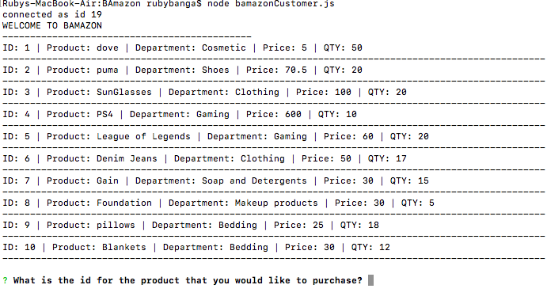
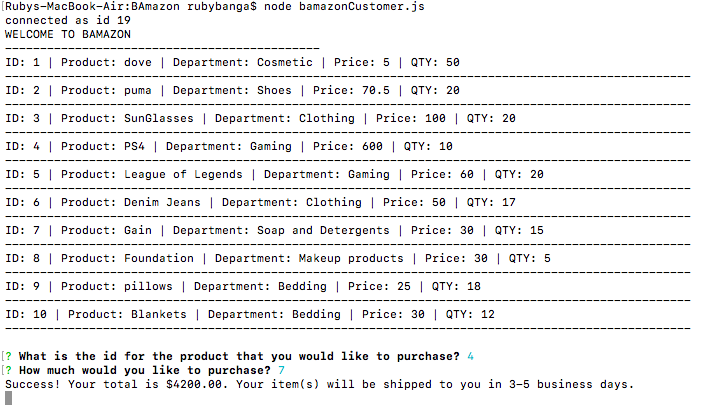
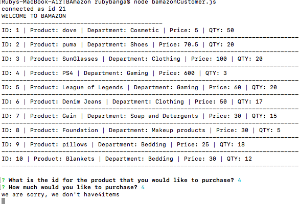
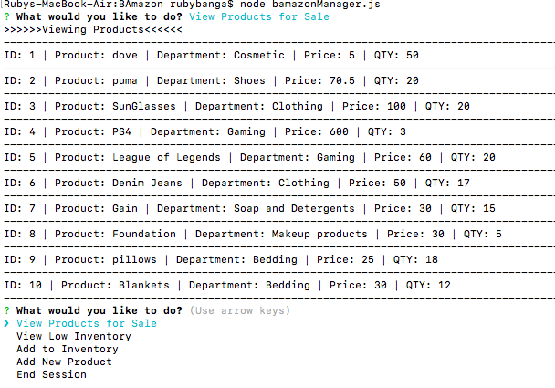
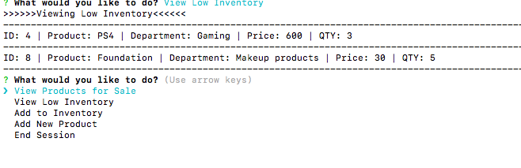
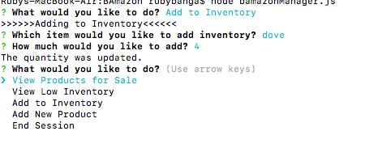
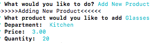
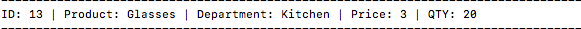

# BAmazon
Created at UCDavis Coding Bootcamp. The goal was to create an Amazon-like store application using Node.js and MySQL.
### What Each JavaScript Does

1. `BamazonCustomer.js`

    * Prints the products in the store.
     
    * Prompts customer which product they would like to purchase by ID number.

    * Asks for the quantity.

      * If there is a sufficient amount of the product in stock, it will return the total for that purchase.
      
      * However, if there is not enough of the product in stock, it will tell the user that there isn't enough of the product.
      
      * If the purchase goes through, it updates the stock quantity to reflect the purchase.
      
      * It will also update the product sales in the department table.

-----------------------

2. `BamazonManager.js`

    * Starts with a menu:
   
        * View Products for Sale
       
        * View Low Inventory
        
        * Add to Inventory

        * Add New Product
        * End Session
 

    * If the manager selects `View Products for Sale`, it lists all of the products in the store including all of their details.

 

    * If the manager selects `View Low Inventory`, it'll list all the products with less than five items in its StockQuantity column.

    

    * If the manager selects `Add to Inventory`, it allows the manager to select a product and add inventory.

    * If the manager selects `Add New Product`, it allows the manager to add a new product to the store.
 
  
  
    * If the manager selects `End Session`, it ends the session and doesn't go back to the menu.

-----------------------
